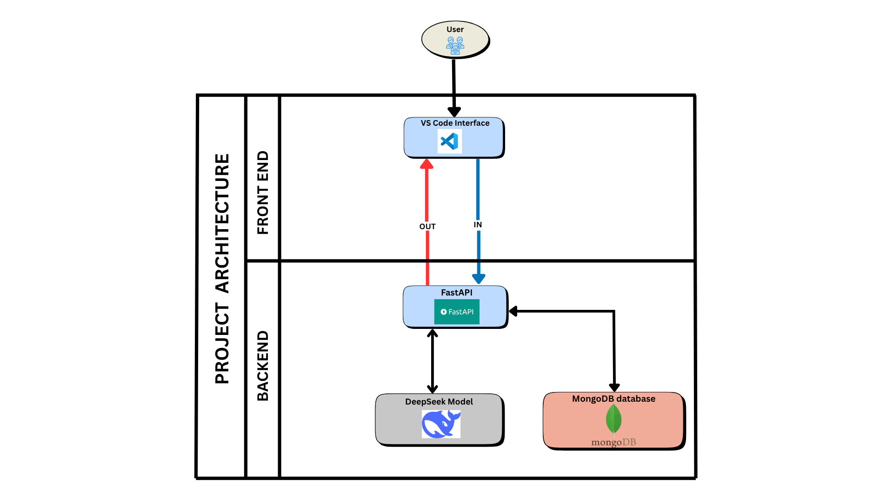

# CodeGenie-G405-PS25
# 🧞‍♂️ Introduction

**CodeGenie** is an intelligent, context-aware **Visual Studio Code extension** designed to assist developers with **smart code generation, debugging support, and error resolution** using natural language prompts. Powered by **DeepSeek-Coder** and a **FastAPI** backend, CodeGenie enhances productivity by delivering **developer-friendly solutions** inside the editor.

---

# 🎯 Purpose of the Project
The purpose of **CodeGenie** is to assist developers by providing **intelligent, context-aware code generation, debugging help, and code completion** directly within **Visual Studio Code**. Unlike traditional tools, **CodeGenie** understands the current file and related files in the workspace, allowing it to generate relevant and accurate responses based on natural language prompts.
It aims to:
   - 🧠 **Reduce development time** with AI-powered code suggestions.

   - 💬 **Enable natural language interaction** for generating and fixing code.

   - 🧩 **Provide context-aware solutions** using the active file and folder structure.

   - 🚀 **Enhance the developer experience** without leaving the VS Code environment.

By combining the power of **DeepSeek-Coder** with an intuitive chat interface, **CodeGenie** helps both beginners and experienced developers write better code, faster.

---

# 🛠️ Applications of the Project
CodeGenie can be applied in various real-world development and learning scenarios:
 - 🧑‍💻 **Code Generation from Natural Language Prompts**
 Generate boilerplate code, algorithms, UI components, and full functions using simple English instructions.

 - 🐞 **Bug Detection & Fix Suggestions**
 Understand error messages and get intelligent suggestions for fixing runtime and syntax errors.

 - 📚 **Learning & Education Tool**
 Ideal for students and beginner programmers to understand how specific code patterns work through AI-generated examples.

 - 🔁 **Code Refactoring & Optimization**
 Improve existing code structure, simplify logic, or convert imperative code into cleaner, more efficient versions.

 - 🛠️ **Rapid Prototyping**
 Build and test feature ideas quickly without writing everything from scratch.

 - 🧩 **Multi-file Project Understanding**
 Analyze and generate code while considering other files in the folder, making it useful in modular codebases.

 - 💼 **Use in Industry & Open Source**
 Help developers in startups, product teams, and open-source projects write production-ready code faster.

---

# 🏗️ Architecture Diagram

---
# ⚙️ Workflow Diagram

---

# Instructions to run CodeGenie
---
# 📄 Research Paper Summary

The development of **CodeGenie** is heavily inspired by the research paper titled
**"DeepSeek-Coder: Towards General-Purpose Code Intelligence"**.
This paper presents a powerful family of open-source code language models trained specifically for programming tasks across over 80 programming languages.

# 🔍 Key Contributions of the Paper
🔤 **Tokenization**
Uses **Byte Pair Encoding (BPE)** tokenizer via HuggingFace to efficiently handle multilingual programming syntax.

🔁 **Multi-Stage Pretraining (MSP)**
The model is first trained on general programming data and later fine-tuned on high-quality, instruction-following datasets, improving reasoning and code generation.

✂️ **Fill-in-the-Middle (FIM)**
Unlike left-to-right models, DeepSeek-Coder is trained to complete code in the middle of two segments, making it ideal for real-world code editing and refactoring.

🧠 **Rotary Positional Embedding (RoPE)**
Uses RoPE with linear scaling to enhance the model's ability to generalize to longer contexts, making it better suited for multi-file projects and large codebases.

⚡ **FlashAttention v2**
Incorporated for efficient memory usage and speed, allowing the model to handle long sequences without performance bottlenecks.

🧠 **Grouped Query Attention (GQA)**
Balances accuracy and efficiency by allowing attention heads to share keys and values, which is important for high-speed inference in tools like CodeGenie.

# 📊 Evaluation Benchmarks
**DeepSeek-Coder** is rigorously tested on:

**HumanEval** – Python-based functional correctness

**MBPP (Mostly Basic Python Problems)** – Real-world usability

**DS-1000** – Multilingual, domain-diverse benchmark created by DeepSeek

---
# 🌐 Availability
 **CodeGenie** is freely available as an open-source Visual Studio Code extension and can be run locally without any paid services.
  
 - **GitHub Repository:** [DeepSeek-Coder](https://github.com/deepseek-ai/DeepSeek-Coder)

## 👥 Contributors Overview

| Name                   | GitHub Profile                                    | Milestone 1 Video                                           | Milestone 2 Video                                           | PPT Link                                                    |
|------------------------|---------------------------------------------------|-------------------------------------------------------------|-------------------------------------------------------------|-------------------------------------------------------------|
| Sreeram | [Sreeram](https://github.com/SreeramDeepak16) | [Milestone1](https://drive.google.com/file/d/1SD49YNDhXl1PcjgK3w0-w38PzQv02tmm/view?usp=drive_link)     | NULL       |   [PPT](https://docs.google.com/presentation/d/1ArK3ZfMu6uLAwdvSsvYL4E6CpN0954DR/edit?usp=sharing&ouid=108593858457322442590&rtpof=true&sd=true)   |
| Avyukth        | [Avyukth](https://github.com/navyukth)      |[Milestone1](https://drive.google.com/file/d/1CqTDUtkMXlZdYcaRfUEDwp0jemH1i8ug/view?usp=drivesdk)| NULL   | [PPT](https://docs.google.com/presentation/d/130Q37Un-BBBfkXQhRB7DQgz_qiHl2gjT/edit?usp=drivesdk&ouid=112607316518503537263&rtpof=true&sd=true)                   |
| Amisha             | [Amisha](https://github.com/AmishaGuruprasad)      | [Milestone1](https://drive.google.com/file/d/1ci1q8Rb0rUZoJz42Bu7EP2rYep5OD8ST/view?usp=sharing)                      | NULL   | [PPT](https://docs.google.com/presentation/d/1qX8bOwxx9MXLMqAOqM4tdTvkX9_o59Cd/edit?usp=drive_link&ouid=109915896286526846905&rtpof=true&sd=true)                    |
| Jaswonthh         | [Jaswonthh](https://github.com/gbj3112) | [Milestone1](https://youtu.be/zgGB5WPL1f0)   | NULL                     | [PPT](https://docs.google.com/presentation/d/19HnpSE435junOzqXTc2QlK0rEIUeumUn/edit?usp=sharing&ouid=109488340599226794078&rtpof=true&sd=true)                   |
| Supradeep            | [Supradeep](https://github.com/Supradeep22) | NULL   | NULL | [PPT](https://docs.google.com/presentation/d/1TLdVOq0sTOoa0nlqIEYYJEtrA2xHNMUo/edit?usp=sharing&ouid=104267641385873067550&rtpof=true&sd=true)                     |
| Harshitha        | [Harshitha](https://github.com/hxrshithx16)| [Milestone1](https://drive.google.com/file/d/12UfxA_QDkllWqt8D9hfUrhFR5lPXrA_D/view?usp=sharing)      | NULL   | [PPT](https://docs.google.com/presentation/d/1n_wZQR07qcyPoeiXuT6wBVYmXP9w_Yi3/edit?usp=sharing&ouid=105934201112247020732&rtpof=true&sd=true)                 |

