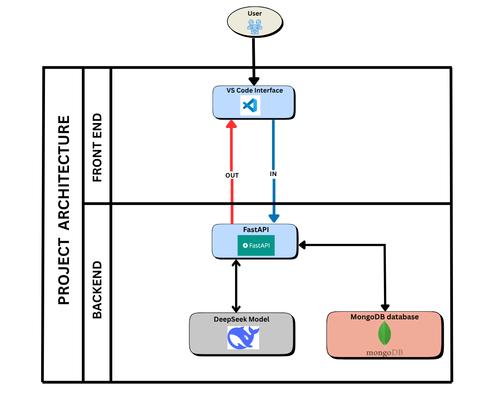

# CodeGenie-G405-PS25

## 🧞‍♂️ Introduction

**CodeGenie** is an intelligent, context-aware **Visual Studio Code extension** designed to assist developers with **smart code generation, debugging support, and error resolution** using natural language prompts. Powered by **DeepSeek-Coder** and a **FastAPI** backend, CodeGenie enhances productivity by delivering **developer-friendly solutions** inside the editor.

---

## 🎯 Purpose of the Project

The purpose of **CodeGenie** is to assist developers by providing **intelligent, context-aware code generation, debugging help, and code completion** directly within **Visual Studio Code**. Unlike traditional tools, **CodeGenie** understands the current file and related files in the workspace, allowing it to generate relevant and accurate responses based on natural language prompts.

It aims to:

- 🧠 **Reduce development time** with AI-powered code suggestions.  
- 💬 **Enable natural language interaction** for generating and fixing code.  
- 🧩 **Provide context-aware solutions** using the active file and folder structure.  
- 🚀 **Enhance the developer experience** without leaving the VS Code environment.  

By combining the power of **DeepSeek-Coder** with an intuitive chat interface, **CodeGenie** helps both beginners and experienced developers write better code, faster.

---

## 🛠️ Applications of the Project

CodeGenie can be applied in various real-world development and learning scenarios:

- 🧑‍💻 **Code Generation from Natural Language Prompts**  
- 🐞 **Bug Detection & Fix Suggestions**  
- 📚 **Learning & Education Tool**  
- 🔁 **Code Refactoring & Optimization**  
- 🛠️ **Rapid Prototyping**  
- 🧩 **Multi-file Project Understanding**  
- 💼 **Use in Industry & Open Source**  

---

## 🏗️ Architecture Diagram

---

## ⚙️ Workflow Diagram

---

## 🧪 Instructions to Run and Install CodeGenie

- Install the extension from the **VS Code Extension Marketplace** or clone and build locally.

---

## 📄 Research Paper Summary

The development of **CodeGenie** is heavily inspired by the research paper titled  
**"DeepSeek-Coder: Towards General-Purpose Code Intelligence"**.

This paper presents a powerful family of open-source code language models trained specifically for programming tasks across over 80 programming languages.

### 🔍 Key Contributions

- 🔤 **Tokenization** – BPE tokenizer via HuggingFace.  
- 🔁 **Multi-Stage Pretraining (MSP)** – Pretrained + instruction-tuned.  
- ✂️ **Fill-in-the-Middle (FIM)** – Completes code in the middle.  
- 🧠 **Rotary Positional Embedding (RoPE)** – Handles long contexts well.  
- ⚡ **FlashAttention v2** – Faster attention with less memory.  
- 🧠 **Grouped Query Attention (GQA)** – Efficient attention for LLM tools.  

## 🌐 Availability

**CodeGenie** is freely available as an open-source Visual Studio Code extension and can be run locally without any paid services.

- GitHub: [DeepSeek-Coder](https://github.com/deepseek-ai/DeepSeek-Coder)

---

## 👥 Contributors Overview

| Name                   | GitHub Profile                                    | Milestone 1 Video                                           | Milestone 2 Video                                           | PPT Link                                                    |
|------------------------|---------------------------------------------------|-------------------------------------------------------------|-------------------------------------------------------------|-------------------------------------------------------------|
| Sreeram | [Sreeram](https://github.com/SreeramDeepak16) | [Milestone1](https://drive.google.com/file/d/1SD49YNDhXl1PcjgK3w0-w38PzQv02tmm/view?usp=drive_link)     | [Milestone2](https://youtu.be/eftee455pTA)      |   [PPT](https://docs.google.com/presentation/d/1ArK3ZfMu6uLAwdvSsvYL4E6CpN0954DR/edit?usp=sharing&ouid=108593858457322442590&rtpof=true&sd=true)   |
| Avyukth        | [Avyukth](https://github.com/navyukth)      |[Milestone1](https://drive.google.com/file/d/1CqTDUtkMXlZdYcaRfUEDwp0jemH1i8ug/view?usp=drivesdk)| [Milestone2](https://www.youtube.com/watch?v=t2yMfdRzrrs&ab_channel=AvyukthNunna)  | [PPT](https://docs.google.com/presentation/d/130Q37Un-BBBfkXQhRB7DQgz_qiHl2gjT/edit?usp=drivesdk&ouid=112607316518503537263&rtpof=true&sd=true)                   |
| Amisha             | [Amisha](https://github.com/AmishaGuruprasad)      | [Milestone1](https://drive.google.com/file/d/1ci1q8Rb0rUZoJz42Bu7EP2rYep5OD8ST/view?usp=sharing)                      | [Milestone2](https://youtu.be/ktHp4AMfne8)  | [PPT](https://docs.google.com/presentation/d/1qX8bOwxx9MXLMqAOqM4tdTvkX9_o59Cd/edit?usp=drive_link&ouid=109915896286526846905&rtpof=true&sd=true)                    |
| Jaswonthh         | [Jaswonthh](https://github.com/gbj3112) | [Milestone1](https://youtu.be/zgGB5WPL1f0)   | [Milestone2](https://youtu.be/QiHnDX_BLCo)                     | [PPT](https://docs.google.com/presentation/d/19HnpSE435junOzqXTc2QlK0rEIUeumUn/edit?usp=sharing&ouid=109488340599226794078&rtpof=true&sd=true)                   |
| Supradeep            | [Supradeep](https://github.com/Supradeep22) | NULL   | [Milestone2](https://youtu.be/1DQYYw2N-VQ?si=wdHhf_t82Ykp8PDP) | [PPT](https://docs.google.com/presentation/d/1TLdVOq0sTOoa0nlqIEYYJEtrA2xHNMUo/edit?usp=sharing&ouid=104267641385873067550&rtpof=true&sd=true)                     |
| Harshitha        | [Harshitha](https://github.com/hxrshithx16)| [Milestone1](https://drive.google.com/file/d/12UfxA_QDkllWqt8D9hfUrhFR5lPXrA_D/view?usp=sharing)      | [Milestone2](https://youtu.be/XnJJSXy8VPQ)   | [PPT](https://docs.google.com/presentation/d/1n_wZQR07qcyPoeiXuT6wBVYmXP9w_Yi3/edit?usp=sharing&ouid=105934201112247020732&rtpof=true&sd=true)                 |

